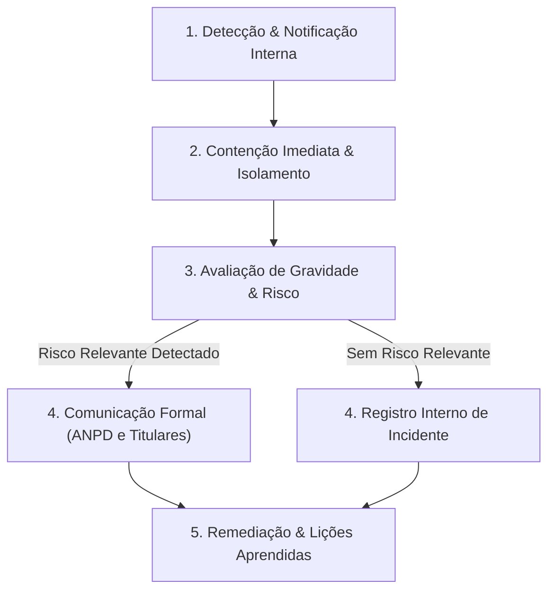

# Plano de Resposta a Incidentes de Segurança com Dados Pessoais — Akasha
*Em conformidade com o Artigo 48 da Lei nº 13.709/2018 (LGPD) e com a Resolução CD/ANPD nº 15/2024*

## 1. Objetivo e Escopo
Estabelecer o Procedimento Operacional Padrão (POP) para detecção, contenção, investigação, mitigação e comunicação formal de qualquer incidente de segurança envolvendo dados pessoais custodiados pela plataforma **Akasha**.

---

## 2. Fluxo de Ação em 5 Fases

---

### Fase 1: Detecção e Triagem
- **Canais de Entrada:** Alertas automatizados de infraestrutura (Render, Supabase), logs de erro atípicos, relatórios de testadores ou comunicação externa via canal `fillipemoreira979@gmail.com`.
- **Ação Imediata:** Registrar o momento exato da ciência do evento e abrir um Relatório Interno de Incidente (RII).

### Fase 2: Contenção Imediata
1. **Revogação de Credenciais:** Se o incidente envolver chaves de API, rotacionar imediatamente `SUPABASE_JWT_SECRET`, `MCP_JWT_SECRET` e tokens externos.
2. **Revogação de Concessões MCP:** Caso detectado abuso em integrações com agentes de IA, invalidar concessões ativas via tabela `mcp_grants` (`revokedAt = NOW()`).
3. **Bloqueio de Origens:** Se envolver exploração de rotas, isolar o tráfego via regras de firewall/CORS no Render.

### Fase 3: Avaliação de Risco e Gravidade (Art. 48 §1º)
Avaliar se o incidente pode acarretar risco ou dano relevante aos titulares:
- **Volume:** Quantidade de contas impactadas.
- **Natureza dos Dados:** Dados de identificação (e-mail, nome) ou metadados de histórico cultural.
- **Circunstâncias:** Acesso não autorizado, vazamento, alteração indevida ou perda de disponibilidade.

### Fase 4: Comunicação (Prazos Legais ANPD)
Se for constatado risco relevante aos direitos e liberdades dos titulares:
- **Prazo para Comunicação à ANPD:** Até **3 (três) dias úteis**, contados a partir do momento em que o controlador teve ciência de que o incidente afeta dados pessoais (conforme art. 7º da Resolução CD/ANPD nº 15/2024).
- **Conteúdo Obrigatório da Notificação:**
  1. Descrição da natureza dos dados pessoais afetados.
  2. Informações sobre os titulares envolvidos.
  3. Indicação das medidas técnicas e de segurança utilizadas para a proteção dos dados.
  4. Riscos relacionados ao incidente.
  5. Motivos da eventual demora, se a comunicação não tiver sido imediata.
  6. Medidas tomadas para reverter ou mitigar os efeitos do prejuízo.
- **Comunicação aos Titulares:** Envio de e-mail informativo claro aos usuários afetados, orientando sobre as medidas tomadas e recomendações de segurança.

### Fase 5: Pós-Incidente e Lições Aprendidas
- Atualização das suítes de testes automatizados com novos cenários de regressão de segurança.
- Revisão do ROPA e endurecimento de regras de firewall e chaves de criptografia.
- Arquivamento do relatório completo do incidente por no mínimo 5 anos.
